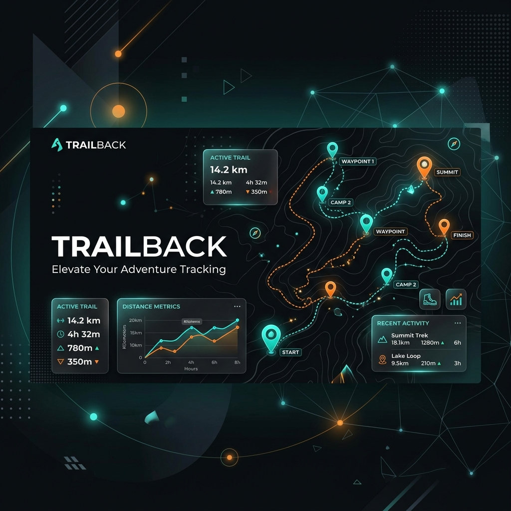

<div align="center">

# 🗺️ T R A I L B A C K

### **Personal Location-History Analyzer**

[](https://trailback.hrynvladyslav07.workers.dev/)

<p align="center">
  Turns Google Takeout location history exports into a stunning interactive map and deep life insights — all processed locally in your browser.
</p>



---

🇺🇦 [Українська версія](#-українська-версія) • 🇬🇧 [English Version](#-english-version)

---

</div>

## 🇺🇦 Українська версія

**Trailback** — це аналізатор особистої історії місцезнаходжень. Він перетворює експорт історії місцезнаходжень Google Takeout на інтерактивну карту та аналітику — кластеризація, відстані та часові патерни, які ніколи не відображаються у власному Timeline від Google.

Це портфоліо-проект: головний фокус зроблено на реальному клієнтському конвеєрі даних (data pipeline) та аналітичному рушії, а не просто переглядачі карти. Все обробляється в межах сесії у браузері — жоден завантажений файл ніколи не надсилається на сервер.

### 🛠️ Технологічний стек

- **React + TypeScript + Vite**
- **Tailwind CSS v4**
- **Leaflet + OpenStreetMap** плитки (теплова карта через плагін `Leaflet.heat`)
- **Аналітичний рушій** (кластеризація, відстані, агрегація) як ізольований модуль із детальними коментарями — див. [src/analytics/](file:///e:/Trailback/src/analytics/).
- **Web Workers**: парсинг та аналітика запускаються у власних Web Workers, тому експорт розміром у кілька сотень мегабайт ніколи не блокує інтерфейс користувача.

### 📂 Підтримувані формати експорту

Додаток автоматично розпізнає структуру файлу за його вмістом, а не за назвою:

- **`Records.json`** — класичний хмарний експорт Хронології (Timeline): необроблені GPS-координати у вигляді цілих чисел `latitudeE7`/`longitudeE7`.
- **`Timeline.json`** — локальний експорт, який замінив хмарний у 2024/2025 роках (Налаштування › Місцезнаходження › Хронологія › Експорт). Сегменти `semanticSegments` містять інформацію про відвідування, активності, шляхи та відстані подорожей від Google з координатами у вигляді рядків `"50.4501°, 30.5234°"`.

> [!NOTE]
> Візит у форматі `Timeline.json` — це *інтервал* часу, а не миттєва подія. Застосунок рівномірно розподіляє (ресемплить) точки протягом тривалості візиту. Без цього алгоритм визначення зупинок бачить нульову тривалість і не знаходить місць. Детальніше див. у функції `expandVisit` в [src/parsing/googleLocationFormats.ts](file:///e:/Trailback/src/parsing/googleLocationFormats.ts).

### 🏷️ Назви місць

Кластеризація визначає наявність локації, але не її назву. Координати центрів кластерів розпізнаються у два рівні:

1. **Foursquare Places** через власний проксі-ендпоінт `/api/place` цього репозиторію. Це потрібно для отримання назв закладів (наприклад, кафе чи банку), оскільки OpenStreetMap зазвичай повертає лише назву вулиці та номер будинку.
2. **Nominatim (OpenStreetMap)** — прямий безкоштовний виклик із браузера без API-ключа. Використовується як резервний варіант.

API-ключ Foursquare зберігається **виключно на сервері**. Клієнт передає на ендпоінт округлені координати, сервер підставляє ключ і робить запит до Foursquare. Ключ ніколи не передається в браузер і навмисно не має префікса `VITE_*` (оскільки Vite вбудовує такі змінні у фронтенд-бандл при збірці).

Провайдера геокодування можна легко змінити без переписування клієнтського коду — браузер знає лише адресу `/api/place`. Перша реалізація використовувала Google Places, який потім безболісно замінили на Foursquare.

Перший рівень є необов'язковим. Якщо ключ не задано, `/api/place` повертає порожню відповідь, і додаток повністю переходить на Nominatim (так само, як і до створення ендпоінту).

> [!IMPORTANT]
> Тільки округлені координати центрів ваших головних локацій виходять за межі браузера (кілька десятків точок). Сам файл експорту нікуди не надсилається. Див. [src/analytics/geocoding.ts](file:///e:/Trailback/src/analytics/geocoding.ts).

### ⚙️ Налаштування

1. Створіть файл конфігурації:
   ```bash
   cp .env.example .env
   ```
2. Перейдіть на [foursquare.com/developers](https://foursquare.com/developers), створіть проект та згенеруйте **Service Key**. Безкоштовний ліміт не потребує введення картки. Впишіть ключ у `.env` як `FOURSQUARE_API_KEY`.
3. Для продуктового розгортання встановіть цю ж змінну в налаштуваннях вашого хостинг-провайдера.

### 💻 Локальна розробка

```bash
npm install
npm run dev
```

Команда `npm run dev` запускає `/api/place` через той самий обробник, який використовується при деплої (див. Vite-плагін у [vite.config.ts](file:///e:/Trailback/vite.config.ts)), тому проксі-ендпоінт повністю працездатний і в локальному оточенні.

### 🚀 Деплой

Файл [api/place.ts](file:///e:/Trailback/api/place.ts) є безконфігураційною функцією Vercel (zero-config). Вся логіка зосереджена в [server/handler.ts](file:///e:/Trailback/server/handler.ts) у вигляді стандартної Web-функції `Request -> Response`. Завдяки цьому міграція на Netlify, Cloudflare Workers чи Deno Deploy потребує лише реекспорту цієї функції у відповідному файлі-точці входу.

### 📈 Статус проекту

Проект розробляється інкрементно. Зараз готові: парсинг, аналітичний рушій, шари карти, а також інтерактивна історія подорожей (scrolling story) з фільтрацією за часом та кешуванням запитів у межах сесії.

---

## 🇬🇧 English Version

**Trailback** is a personal location-history analyzer. It turns a Google Takeout location history export into an interactive map plus life insights — clustering, distances, and time patterns Google's own Timeline never surfaces.

This is a portfolio project: the focus is a real client-side data pipeline and analytics engine, not just a map viewer. Everything is processed in-session in the browser — no uploaded file is ever sent to a server.

### 🛠️ Tech Stack

- **React + TypeScript + Vite**
- **Tailwind CSS v4**
- **Leaflet + OpenStreetMap** tiles (heatmap via `Leaflet.heat` plugin)
- **Analytics engine** (clustering, distance, aggregation) as an isolated, heavily-commented module — see [src/analytics/](file:///e:/Trailback/src/analytics/).
- **Web Workers**: parsing and analytics run in background threads, ensuring that importing multi-hundred-megabyte files never blocks the user interface.

### 📂 Supported Exports

The application automatically detects the structure based on file contents, not the filename:

- **`Records.json`** — classic cloud Timeline export: raw GPS coordinates as `latitudeE7`/`longitudeE7` integers.
- **`Timeline.json`** — the on-device export that replaced the cloud version in 2024/2025 (Settings › Location › Timeline › Export). Its `semanticSegments` contain visits, activities, waypoint paths, and Google-calculated trip distances, with coordinates formatted as `"50.4501°, 30.5234°"` strings.

> [!NOTE]
> A visit in the `Timeline.json` format represents a time *span* rather than a single moment. The app resamples coordinates across the visit's duration. Without this resampling, stay detection would see zero-length stays and fail to identify top locations. See the `expandVisit` function in [src/parsing/googleLocationFormats.ts](file:///e:/Trailback/src/parsing/googleLocationFormats.ts) for details.

### 🏷️ Place Names

Clustering confirms a place exists, but cannot name it. Cluster centers are resolved in two tiers:

1. **Foursquare Places**, via this repository's proxy endpoint `/api/place`. A dedicated venue database is essential here: OpenStreetMap typically responds to a query about a business by returning the street and house number instead of the venue name.
2. **Nominatim (OpenStreetMap)**, called directly from the browser. Free, keyless, and serves as the fallback for locations Foursquare cannot resolve.

The Foursquare API key is **server-side only**. The browser sends rounded coordinates to our proxy endpoint, which attaches the API key and queries Foursquare. The key is never exposed to the client and is intentionally not prefixed with `VITE_*` (since Vite inlines those into the client bundle at build time).

The geocoding provider can be easily swapped without modifying any client fetch code, as the browser only interacts with `/api/place`. The initial implementation used Google Places and was seamlessly replaced with Foursquare.

Tier 1 is optional. If no key is configured, `/api/place` returns an empty result, and the app falls back entirely to Nominatim (matching its original behavior).

> [!IMPORTANT]
> Only rounded coordinates of your top cluster centers leave the browser (a few dozen points). The original export file is processed entirely in the browser and never uploaded. See [src/analytics/geocoding.ts](file:///e:/Trailback/src/analytics/geocoding.ts).

### ⚙️ Setup

1. Copy the environment template:
   ```bash
   cp .env.example .env
   ```
2. Visit [foursquare.com/developers](https://foursquare.com/developers), create a project, and generate a **Service Key** (the free tier does not require a credit card). Paste it into `.env` as `FOURSQUARE_API_KEY`.
3. Set the same environment variable in your production hosting platform settings.

### 💻 Development

```bash
npm install
npm run dev
```

Running `npm run dev` serves the `/api/place` endpoint using the same handler deployed in production (see the Vite plugin in [vite.config.ts](file:///e:/Trailback/vite.config.ts)), allowing local testing of the venue-lookup flow.

### 🚀 Deploying

The file [api/place.ts](file:///e:/Trailback/api/place.ts) is a zero-config Vercel function. All core logic resides in [server/handler.ts](file:///e:/Trailback/server/handler.ts) as a platform-agnostic, standard `Request -> Response` Web function. Migrating to Netlify, Cloudflare Workers, or Deno Deploy is simple and only requires re-exporting this function in the respective platform's entry file.

### 📈 Project Status

Built incrementally. Current features include: parsing, the analytics engine, interactive map layers, and the scrolling travel story, all controlled by a time-range filter with in-session caching.
